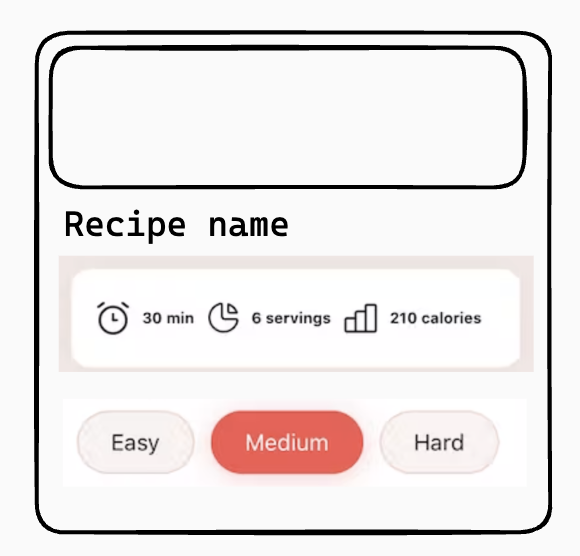

# TODO

- Create `App`, `Recipes` and `RecipeCard` components
- `App` imports an arrayof recipes from `recipes.json` and renders `Recipes` component
- `Recipes` accepts `items` prop and renders a list of `RecipeCard` components
- `RecipeCard` accepts `recipe` prop and renders UI with recipe image, name, info and difficulty badges (not buttons).
- Use prop-types library where applicable

