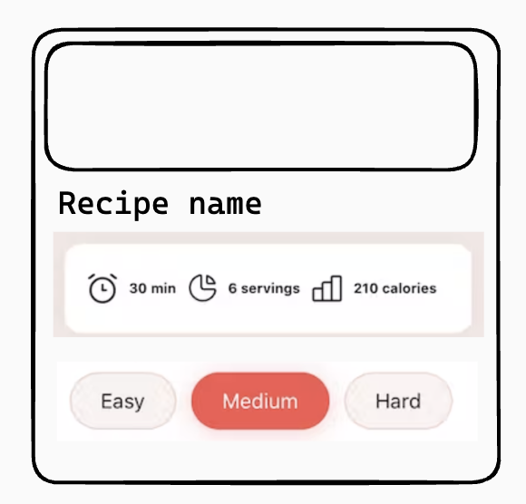

# TODO

- Continue working on Recipes App from previous lesson
- Use styled-components or emotion
- Add Global Styles and CSS Normalization
- Add basic theming with color palette
- Add minimal styling with flexbox, spacing and colors
- Use react-icons library for three icons of the info block (time, calories, servings)
- Style difficulty badges in `RecipeCard` so that the active one is highligted

