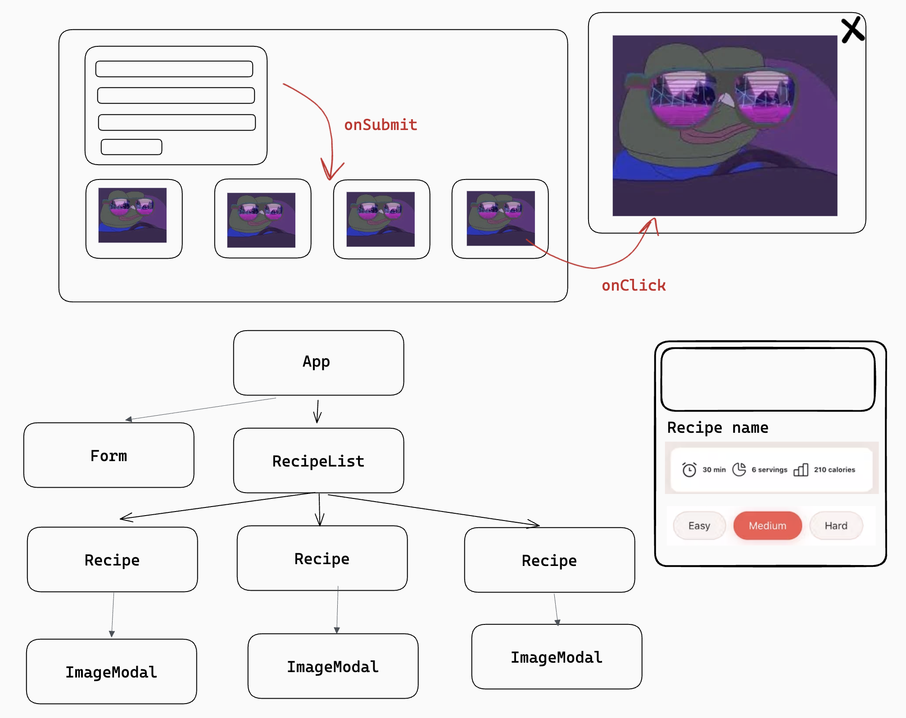

# TODO

- Continue working on Recipes App from previous lesson
- Add two buttons to the `RecipeCard`
  - For deleting a recipe
  - For showing a modal with large recipe image
- Add state to the `App` to store recipes
- Recipes from `recipes.json` should be default state value
- Pass `App` state to `Recipes` component
- Add `deleteRecipe(recipeId)` method to the `App`
- Pass `delteRecipe` method as a prop to `RecipeCard` thru `Recipes`
  - Explain prop naming (`onPropName`)
  - Explain prop drilling
  - Explain passing arguments (recipe ID in this case)
  - Explain `setState`
- Create `ImageModal` component and render it in the `RecipeCard`
  - Use react-modal library to create a modal
  - Refactor `RecipeCard` into a class and add state to show `ImageModal` component
  - Clicking on «show modal button» should render a modal with large image of that recipe

